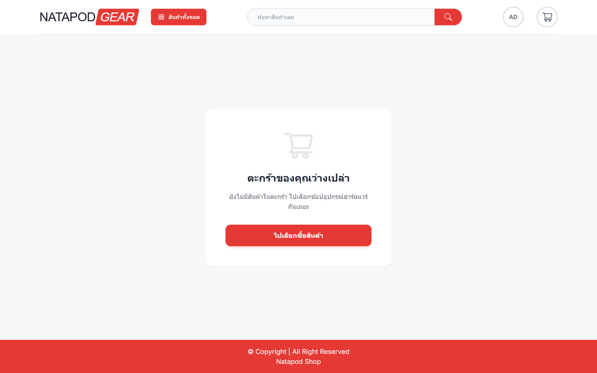

# 🛒 E-commerce Fullstack App

## 📌 Description
A fullstack e-commerce web application with user and admin system.

## 🚀 Features
- User authentication (login/register)
- Product listing and search
- Shopping cart system
- Admin dashboard (manage products)
- Image upload system

## 🛠 Tech Stack
- Frontend: HTML, CSS, JavaScript
- Backend: Node.js / Express
- Database: MongoDB
- Cloud: Google Cloud
- File Upload: UploadThing

## 💡 What I Learned
- Built a fullstack web application from scratch
- Implemented authentication and database integration
- Managed file uploads and cloud services
- Designed both user and admin systems

## 📷 Screenshots

## 📌 Status
This project is still under development.